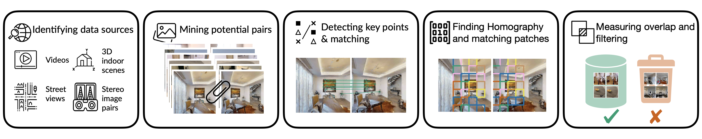
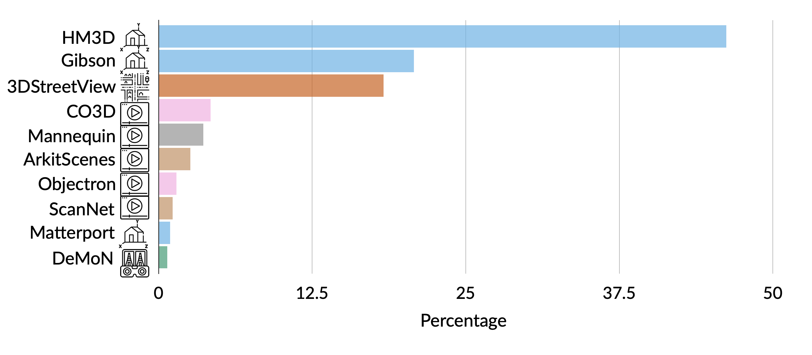

# MIMIC: Masked Image Modeling with Image Correspondences
Welcome to the official repository of MIMIC! MIMIC is a data curation method that can be used to mine multiview image pairs from videos and synthetic 3D environments. It does not require any annotations such as  3D meshes, point clouds, and camera parameters. Using our method we curate MIMIC-3M, a dataset of 3.1 M image pairs, and train [MAE](https://github.com/facebookresearch/mae) and [CroCo](https://github.com/naver/croco) objectives.  
In this repository, we provide the scripts and instructions to download and curate MIMIC-3M. We also provide the code to train [CroCo](https://github.com/naver/croco) and open-source the checkpoint trained using MIMIC-3M.    


# MIMIC-3M
The figure below shows the end-to-end pipeline of MIMIC. MIMIC identifies data sources with indoor scenes/people/objects videos, 3D indoor environments, outdoor street views, and stereo pairs to determine potential
multiview images. Next, it leverages traditional computer vision methods such as SIFT keypoint detection and homography transformation to locate corresponding patches. Finally, it filters pairs based on a threshold for significant overlap, ensuring a substantial percentage of pixels match between a pair.
<p align="center">
  
</p>


## Dataset composition
The figure below shows the distribution of MIMIC-3M. Real data sources, including DeMoN, ScanNet, ArkitScenes, Objectron, CO3D, Mannequin, and 3DStreetView, contribute to 32% of MIMIC. The remaining portion consists of synthetic sources, namely HM3D, Gibson, and Matterport.

<p align="center">
  
</p>


## Dataset curations scripts
The instructions to mine potential pairs are provided in [DATASET.md](datasets/DATASET.md). You can also use these scripts to mine potential pairs on your own video datasets/ synthetic environments. 
Refer to the following file for setting up a conda environment to mine MIMIC-3M : [dataset.yml](datasets/dataset.yml)


## Downloading MIMIC-3M

 You can download the zip file of image pairs with metadata from different sources here: [HM3D](https://drive.google.com/file/d/1xitNF_vKrx5lqe1eWmEPlFl63l6WxL__/view?usp=sharing), [Gibson](https://drive.google.com/file/d/198KYNLk-9MiJ_4QjbaK_fayPNDAkM_j1/view?usp=sharing), [Matterport](https://drive.google.com/file/d/1mYhuYQxOwEpKT45j1MEifq92DTZV7jOB/view?usp=sharing), [Mannequin](https://drive.google.com/file/d/160rcbEXkpLrDdu13YK6t4cbwrGm-4l3k/view?usp=sharing), [ArkitScenes](https://drive.google.com/file/d/1ifSPHKU9VQ1AeimvXfp_CsJAXqTw9BSX/view?usp=sharing), [CO3D](https://drive.google.com/file/d/1Wszh2dyYEUY2WA-EBcWdk1RIztTcx06H/view?usp=sharing), [Objectron](https://drive.google.com/file/d/1OC5k6zOfOPVD85w74qHK7OEO6QhAi7iF/view?usp=sharing), [3DStreetView](https://drive.google.com/file/d/14eH-5UY0_PCOXYXEeOGl2nekhK31Y8Yq/view?usp=sharing), [DeMoN](https://drive.google.com/file/d/1_1TujxKg22PtdJV4-tMBK08KOU_UktWi/view?usp=sharing), [ScanNet](https://drive.google.com/file/d/1G-lJ7qcGu8HuOzPO22MgaUXJeM1WCLL2/view?usp=sharing).
The whole dataset can be downloaded [here](https://drive.google.com/drive/folders/1UBCTsAQv5_sfgx1tj8yGbZqKVUu9HIfV?usp=sharing). The CSV file containing paths for all 3 million image pairs is [here](https://drive.google.com/file/d/18yp6q8gQihEyyPtGudIBIHVEHL-VPXyo/view?usp=sharing).
 After unzipping the files, you will find the following folder structure:

 ```bash
 <MIMIC>
    <Dataset_Name>
        <Video/Scene_ID>
            <Pair_Number>
                <0000.jpg>  ## view 1
                <0001.jpg>  ## view 2
                <corresponding.npy> ## correspondence info
        <Video/Scene_ID>
            <Pair_Number>
                <0000.jpg>  ## view 1
                <0001.jpg>  ## view 2
                <corresponding.npy> ## correspondence info
        .
        .
        .
    .
    .
    .

 ```

The file `corresponding.npy` contains the patch correspondences between view1 and view2. It is a Python dictionary e.g. `{1:2, 15:100, 121: 4}` in which the keys are the patch numbers in the first view (`0000.jpg`) and the values are the patch numbers in the second view (`0001.jpg`). We assign index `0` to the top left patch and traverse row by row.
 

# Training

Refer to [mae.yml](model/mae.yml) for creating a conda environment for pretraining. 
The command to train CroCo on MIMIC is provided below. The effective batch size (batch_size_per_gpu * nodes * gpus_per_node * accum_iter) is equal to 4096.

```bash
torchrun --nproc_per_node=8 main_pretrain.py  --multiview \
    --batch_size 128 \
    --accum_iter 4 \
    --model mae_vit_base_patch16 \
    --norm_pix_loss \
    --mask_ratio 0.9 \
    --epochs 200 \
    --blr 1.5e-4 \
    --warmup_epochs 20 \
    --train_path_csv /path/to/csv \
    --base_data_path /path/to/MIMIC/data/folder
 ```

To train models in a multi-node setup refer to the following command:
```bash
python /gscratch/sciencehub/kmarathe/models/MIMIC/MIMIC/model/submitit_pretrain.py \
    --job_dir job_dir \
    --base_data_path base_data_path \
    --train_path_csv /path/to/csv \
    --multiview \
    --accum_iter 4 \
    --nodes 2 \
    --batch_size 64 \
    --model mae_vit_base_patch16 \
    --norm_pix_loss \
    --mask_ratio 0.9 \
    --epochs 200 \
    --warmup_epochs 20 \
    --blr 1.5e-4 \
    --account account \
    --partition gpu-a40 \
    --timeout timeout --report_to_wandb \
    --wandb_project croco --wandb_entity entity \
    --run_name croco_200_vitb \
```


 # Evaluation

 ## Pretrained checkpoint

The following table provides the pre-trained checkpoint on MIMIC-3M used in the paper.
<table><tbody>
<!-- START TABLE -->
<!-- TABLE HEADER -->
<th valign="bottom"></th>
<th valign="bottom">ViT-Base</th>

<!-- TABLE BODY -->
<tr><td align="left">pre-trained checkpoint</td>
<td align="center"><a href="https://drive.google.com/file/d/1rwaGr-8iH4munfdouNqBDQCU5PwnLpgD/view?usp=sharing">download</a></td>
</tr>
</tbody></table> 

## Finetuning code
For fine-tuning, refer to [MAE](https://github.com/facebookresearch/mae/blob/main/FINETUNE.md) for linear probing, [MultiMAE](https://github.com/EPFL-VILAB/MultiMAE/blob/main/FINETUNING.md) for semantic segmentation and depth estimation, and [ViTPose](https://github.com/ViTAE-Transformer/ViTPose) for pose estimation. Make sure to convert the checkpoint to the MultiMAE format before evaluations using the following converter: [link](https://github.com/EPFL-VILAB/MultiMAE/blob/main/tools/vit2multimae_converter.py) for depth estimation and semantic segmentations tasks

The log files of the finetuning runs are in [finetune](finetune).

# Acknowledgements
The code for model training is built on top of [MAE](https://github.com/facebookresearch/mae), uses cross-attention blocks from [CroCo](https://github.com/naver/croco), and refers to [MultiMAE](https://github.com/EPFL-VILAB/MultiMAE/tree/main) for evaluations. We thank them all for open-sourcing their work.  


# License
This project is under the CC-BY-NC 4.0 license. See [LICENSE](LICENSE) for details.
